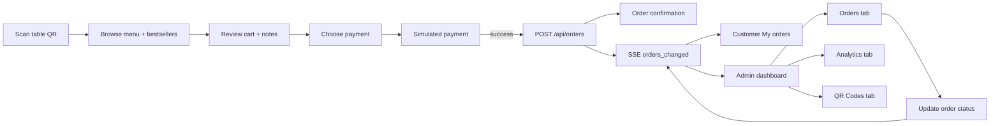

# QR Order System — Q Sina

A mini restaurant QR ordering system for **Q Sina**. Customers scan a table QR code to browse the menu (with live bestseller highlights), build a cart, and pay via a simulated checkout. They can track order status in real time from **My orders**. Staff use a single admin dashboard with live order updates, sales analytics, and table QR code generation.

## Stack

- **Frontend:** React 18 + Vite + Tailwind CSS + React Router + Lucide icons + Recharts
- **Backend:** Node.js + Express + mysql2 + express-validator
- **Database:** MySQL 8

**Notable frontend libraries:** `recharts` (analytics charts), `qrcode.react` + `jspdf` (QR generation and bulk PDF export).

## Project structure

Monorepo with a root `package.json` that orchestrates the backend and frontend workspaces. There is no separate top-level `api/` or `scripts/` folder — the REST API lives under `backend/src/`.

```
QR-Order-System/
├── package.json              # Root scripts (dev, seed, build)
├── backend/
│   ├── .env.example
│   ├── db/
│   │   ├── schema.sql        # Full database schema (source of truth)
│   │   └── seed.js           # Sample Q Sina menu data
│   └── src/
│       ├── app.js            # Express entry point
│       ├── config/db.js      # MySQL connection pool
│       ├── orderEvents.js    # SSE broadcast helpers
│       ├── middleware/       # errorHandler.js, rateLimit.js
│       └── routes/           # products.js, orders.js
└── frontend/
    ├── index.html
    ├── vite.config.js        # Dev server + /api proxy to :4000
    └── src/
        ├── main.jsx            # React Router routes
        ├── context/            # Cart state (CartContext)
        ├── hooks/              # useProducts, useOrders, useTableOrders
        ├── utils/              # periodUtils, analyticsUtils (client-side aggregations)
        ├── components/           # Menu/cart UI, AdminTabBar, AnalyticsTab, …
        └── pages/              # OrderPage.jsx, AdminPage.jsx
```

## Scripts

Run these from the project root unless noted:

| Command | Description |
|---------|-------------|
| `npm install` | Install root, backend, and frontend dependencies |
| `npm run dev` | Start backend (`:4000`) and frontend (`:5173`) together |
| `npm run dev:backend` | Backend only (nodemon) |
| `npm run dev:frontend` | Frontend only (Vite) |
| `npm run seed` | Reset and seed sample menu data |
| `npm run build` | Production build → `frontend/dist` |
| `npm run start --prefix backend` | Run backend in production mode |

## Setup

### Prerequisites

Install these before you begin:

| Tool | Version | Notes |
|------|---------|-------|
| [Node.js](https://nodejs.org/) | 18+ (20 LTS recommended) | Includes `npm` |
| [MySQL](https://dev.mysql.com/downloads/) | 8.x | Server must be running locally or reachable on your network |
| Git | Any recent version | To clone the repository |

Confirm they are available:

```bash
node -v
npm -v
mysql --version
```

### 1. Clone and enter the project

```bash
git clone <repository-url>
cd QR-Order-System
```

### 2. Install dependencies

From the project root:

```bash
npm install
```

This installs root, backend, and frontend packages (`postinstall` runs the workspace installs automatically).

To install backend and frontend only (without root dev tools):

```bash
npm run install:all
```

### 3. Create the database

Make sure the MySQL server is running, then apply the schema. It creates the `mini_qr_ordering_system` database and all tables (`products`, `orders`, `order_items`). The `backend/db/` folder contains only `schema.sql` and `seed.js` — there are no incremental migration scripts; re-run `schema.sql` to reset the schema.

**macOS / Linux / Git Bash:**

```bash
mysql -u root -p < backend/db/schema.sql
```

**Windows (PowerShell)** — run from the project root:

```powershell
Get-Content backend\db\schema.sql | mysql -u root -p
```

**Alternative:** open `backend/db/schema.sql` in MySQL Workbench (or another client) and execute the script.

### 4. Configure environment variables

Copy the example env file and edit it with your MySQL credentials:

**macOS / Linux / Git Bash:**

```bash
cp backend/.env.example backend/.env
```

**Windows (PowerShell):**

```powershell
Copy-Item backend\.env.example backend\.env
```

Edit `backend/.env`:

```env
DB_HOST=localhost
DB_PORT=3306
DB_USER=root
DB_PASS=your_mysql_password
DB_NAME=mini_qr_ordering_system
PORT=4000
TAX_RATE=0.12
FRONTEND_URL=http://localhost:5173
```

| Variable | Purpose |
|----------|---------|
| `DB_HOST` / `DB_PORT` | MySQL connection |
| `DB_USER` / `DB_PASS` | MySQL credentials (`DB_PASS` can be empty for a local root user with no password) |
| `DB_NAME` | Must match the database created by `schema.sql` |
| `PORT` | Backend API port (default `4000`) |
| `TAX_RATE` | Decimal tax rate applied server-side when creating orders (default `0.12` = 12%) |
| `FRONTEND_URL` | Allowed CORS origin for the frontend dev server |

### 5. Seed sample menu data

Populate the database with Q Sina menu items (13 products across Appetizers, Main Dish, Desserts, and Drinks):

```bash
npm run seed
```

**Note:** Seeding clears existing `products`, `orders`, and `order_items` before inserting fresh menu data. Safe for local development; do not run on production data you want to keep.

Expected output:

```
Connected to database. Seeding products...
Seeded 13 products successfully.
```

### 6. Start the development servers

```bash
npm run dev
```

This starts both services concurrently:

| Service | URL |
|---------|-----|
| Frontend (Vite) | http://localhost:5173 |
| Backend (Express) | http://localhost:4000 |

The frontend proxies `/api/*` to the backend, so the browser only needs to talk to port `5173` during development.

To run one service at a time:

```bash
npm run dev:backend    # API only
npm run dev:frontend   # UI only (requires backend for menu/orders)
```

### 7. Verify the installation

1. **API health check** — open http://localhost:4000/api/health  
   Expected: `{"status":"ok"}`

2. **Menu data** — open http://localhost:4000/api/products  
   Expected: JSON with 13 menu items, each including `units_sold` (0 on a fresh seed).

3. **Frontend** — open http://localhost:5173  
   You should land on the admin dashboard.

4. **Test an order**
   - Open http://localhost:5173/order?table=1
   - Add items to the cart, proceed through checkout, and complete the simulated payment
   - Open **My orders** on the menu screen (or return to `/admin`) and confirm the order appears with live status updates

5. **Analytics** — open http://localhost:5173/admin?tab=analytics  
   After placing a paid order, confirm KPIs and charts populate (top items, revenue over time, etc.).

### 8. Test QR scanning with a phone

Phones cannot open `localhost` on your computer. To scan table QR codes during development, use your machine's LAN IP and keep the phone on the **same Wi‑Fi network** as the dev server.

#### Prepare the dev server for phone access

1. **Find your computer's LAN IP address**

   **Windows (PowerShell):**

   ```powershell
   ipconfig
   ```

   Look for **IPv4 Address** under your active Wi‑Fi adapter (e.g. `192.168.1.42`).

   **macOS / Linux:**

   ```bash
   ipconfig getifaddr en0
   ```

   On Linux, `hostname -I` also works if you need the first address on the machine.

2. **Allow CORS from that address** — edit `backend/.env` and set `FRONTEND_URL` to your LAN origin (replace the example IP):

   ```env
   FRONTEND_URL=http://192.168.1.42:5173
   ```

   Restart the backend if it is already running so the new origin is picked up.

3. **Start (or restart) the dev servers** from the project root:

   ```bash
   npm run dev
   ```

   The Vite dev server is configured with `host: true`, so it listens on your network interface as well as `localhost`.

4. **Open the admin dashboard using the LAN IP**, not `localhost`:

   ```
   http://192.168.1.42:5173/admin?tab=qr
   ```

   QR codes are generated from `window.location.origin`. If you open admin at `localhost`, the codes will point at `http://localhost:5173/...` and will not work on a phone.

5. **Allow through the firewall** if the phone cannot connect — permit inbound TCP on port **5173** (and ensure Node.js is allowed on Windows Defender Firewall).

#### Generate and print table QR codes

1. In the admin dashboard, open the **QR Codes** tab (`/admin?tab=qr`).
2. Set the number of tables and preview each code.
3. Download individual PNGs or export all tables as a bulk PDF.
4. Print and place a code on each table. Each code links to `{origin}/order?table=N` (e.g. `http://192.168.1.42:5173/order?table=3`).

#### Scan and order on the phone

1. Open the phone's **Camera** app (iPhone/Android) or any QR scanner app.
2. Point the camera at the table QR code until a link notification appears.
3. Tap the link — the browser opens the customer menu at `/order?table=N`.
4. Confirm the header shows **Table N**, then browse the menu, add items, and complete checkout.
5. Use **My orders** on the menu screen to track status in real time as staff update orders on the admin dashboard.

If you open `/order` without a valid `?table=` parameter (or with a non-numeric value), the app shows an **Invalid Table** screen asking you to scan the table QR code.

#### Production / restaurant Wi‑Fi

In production, deploy the frontend and API behind your public domain (HTTPS recommended). Open `/admin?tab=qr` on that deployed URL before generating codes so each QR encodes the live site origin. Customers on the restaurant Wi‑Fi scan the printed codes the same way — camera → tap link → order.

### Production build (optional)

Build the frontend for static hosting:

```bash
npm run build
```

Output is written to `frontend/dist`. Serve it behind a reverse proxy that forwards `/api` to the Express backend (same pattern as the Vite dev proxy).

Start the backend in production:

```bash
npm run start --prefix backend
```

### Troubleshooting

| Problem | Likely cause | Fix |
|---------|--------------|-----|
| `ECONNREFUSED` or seed/API DB errors | MySQL not running or wrong credentials | Start MySQL; verify `backend/.env` matches your server |
| `Unknown database` | Schema not applied | Re-run step 3 (`schema.sql`) |
| Need a clean database | Old schema or test data | Drop/recreate the database, re-run `schema.sql`, then `npm run seed` |
| Frontend loads but menu is empty / API errors | Backend not running | Run `npm run dev:backend` or full `npm run dev` |
| `Port 4000 already in use` | Another process on that port | Change `PORT` in `backend/.env` and update the Vite proxy target in `frontend/vite.config.js` |
| `Port 5173 already in use` | Another Vite app running | Stop the other process or change the port in `frontend/vite.config.js` |
| `mysql` command not found | MySQL CLI not in PATH | Use MySQL Workbench, or add MySQL `bin` to your system PATH |
| Seed fails with access denied | Wrong `DB_USER` / `DB_PASS` | Update `backend/.env` and retry |
| `Too many orders` (HTTP 429) | Table hit the order rate limit | Wait 5 minutes or use a different table number |
| Analytics charts show "No paid orders" | No completed paid orders in the selected period | Place a test order through checkout, or switch to **All time** |
| Phone QR opens but menu is empty / API blocked | CORS or wrong origin | Set `FRONTEND_URL` in `backend/.env` to `http://<your-LAN-IP>:5173` and restart the backend |
| Phone cannot load the site after scanning | Different network, firewall, or QR points at `localhost` | Same Wi‑Fi as dev machine; open admin via LAN IP before generating QR codes; allow port 5173 through the firewall |
| **Invalid Table** after scanning | QR missing or corrupt `?table=` | Regenerate the code from **QR Codes** tab; URL must be `/order?table=N` with N = 1–99 |

## Application Flow

### Restaurant deployment

1. Open **`/admin`** (the app root `/` redirects here).
2. Use the **QR Codes** tab to set the number of tables and download codes (individual PNG or bulk PDF).
3. Each QR encodes `{origin}/order?table=N` — print and place on tables. Customers scan with their phone camera and tap the link to open the menu. For local development over Wi‑Fi, see [Test QR scanning with a phone](#8-test-qr-scanning-with-a-phone).
4. Use the **Orders** tab to monitor incoming orders and advance their status.
5. Use the **Analytics** tab to review sales trends, top dishes, and peak hours.

### Customer flow

```
Scan QR → Menu → Cart → Checkout → Payment → Confirmation → My orders
```

| Step | Screen | What happens |
|------|--------|--------------|
| 1 | **Menu** | Customer lands on `/order?table=N`. Menu loads from the API, grouped by category. A **Best sellers** row highlights the top three items by units sold (once orders exist). Tap an item to open its detail modal and add to cart. |
| 2 | **Cart** | Review line items, adjust quantities, add an optional kitchen note, and see subtotal + 12% tax. |
| 3 | **Checkout** | Confirm table number, choose **GCash** or **Card**, and review the order summary. |
| 4 | **Payment** | Tap **Confirm & Pay** to run the payment simulator (~90% success). On success, the order is posted to the API. |
| 5 | **Confirmation** | Shows order number and a live progress indicator. Customer can open **My orders** or return to the menu to order again. |
| 6 | **My orders** | Lists all orders for the current table with line items, totals, and status badges. Active orders show a step progress bar that updates in real time as staff advance the order. |

Orders are created with `payment_status: paid` and `order_status: received`. Visiting `/order` without a valid `?table=` query shows an invalid-table message. Order placement is rate-limited to 5 orders per table every 5 minutes. **My orders** and the admin dashboard both subscribe to the same SSE stream (`/api/orders/events`) for live status updates.

### Staff flow (admin)

The admin dashboard at **`/admin`** has three tabs — **Orders**, **Analytics**, and **QR Codes** — controlled by the `?tab=` query parameter. All tabs share the same live order data (Server-Sent Events with a 90-second polling fallback).

#### Orders tab (default — `/admin` or `/admin?tab=orders`)

1. Review the stats bar for **Today**, **This week**, **This month**, or **All time**: order count, active orders, completed count, and paid revenue.
2. Filter the order list by status (All, Active, Ready, Completed, Cancelled).
3. Each order card shows line items, kitchen notes, payment/order status, and totals.
4. Advance **`order_status`** through the lifecycle:

   `received` → `preparing` → `ready` → `completed`

   Orders can also be set to `cancelled`. Status changes push instantly to customer **My orders** screens.
5. Delete orders permanently when needed (with confirmation).

Payment status is set at checkout and is read-only in the admin UI.

#### Analytics tab (`/admin?tab=analytics`)

Sales insights computed **client-side** from existing order data — no separate analytics API. Only **paid** orders are included; **cancelled** orders are excluded.

| Feature | Description |
|---------|-------------|
| **Period filter** | Today, This week, This month, All time |
| **KPIs** | Total revenue, order count, average order value |
| **Top items by revenue** | Horizontal bar chart — top 10 dishes by line-item revenue |
| **Top items by quantity** | Horizontal bar chart — top 10 dishes by units sold |
| **Revenue over time** | Line chart — hourly (today), daily (week/month), weekly buckets when all-time spans 90+ days |
| **Revenue by category** | Donut chart — share of sales by menu category (from product data) |
| **Peak hours** | Combo chart — order count (bars) and revenue (line) by hour of day |

Charts update when you switch periods or when new orders arrive via SSE.

#### QR Codes tab (`/admin?tab=qr`)

1. Set the table count (1–50) with **Add Table** / **Remove Table**.
2. Preview a QR code per table; each links to `{origin}/order?table=N`.
3. Download a single table as PNG, or export all tables as a bulk PDF.



## Key modules

| Area | Module | Role |
|------|--------|------|
| **Hooks** | `useProducts` | Fetches menu items and bestseller data from `/api/products` |
| | `useOrders` | Admin order list with SSE + polling fallback; supports PATCH/DELETE |
| | `useTableOrders` | Customer **My orders** — orders for the current `?table=` |
| **Customer UI** | `OrderPage` | Multi-screen flow: menu → cart → checkout → payment → confirmation → my orders |
| | `BestsellerSection` | Top 3 items by `units_sold` on the menu |
| | `PaymentSimulator` | Simulated GCash/Card payment (~90% success) before order submission |
| **Admin UI** | `AdminPage` | Tab shell for orders, analytics, and QR generation |
| | `AdminTabBar` | Orders \| Analytics \| QR Codes navigation |
| | `AnalyticsTab` | Recharts dashboards (aggregates via `analyticsUtils`) |
| **Utils** | `periodUtils` | Shared Today / Week / Month / All time date filtering |
| | `analyticsUtils` | Client-side revenue, top-item, category, and peak-hour aggregations |
| **Backend** | `orderEvents.js` | Broadcasts `orders_changed` to SSE clients after create/update/delete |
| | `rateLimit.js` | 5 orders per table per 5 minutes on `POST /api/orders` |

## Routes

| URL | Description |
|-----|-------------|
| `/` | Redirects to `/admin` |
| `/order?table=N` | Customer ordering (mobile-style UI; requires valid table 1–99) |
| `/admin` | Admin dashboard — **Orders** tab (default): stats, orders board, status updates |
| `/admin?tab=orders` | Same as `/admin` — orders board and period stats |
| `/admin?tab=analytics` | Admin dashboard — **Analytics** tab: charts and sales KPIs |
| `/admin?tab=qr` | Admin dashboard — **QR Codes** tab: generate and download table QR codes |
| `/qr-generator` | Redirects to `/admin?tab=qr` (legacy alias) |

## API Endpoints

| Method | Endpoint | Description |
|--------|----------|-------------|
| GET | `/api/health` | Health check — returns `{ "status": "ok" }` |
| GET | `/api/products` | List available menu items with `units_sold` (from non-cancelled orders) |
| GET | `/api/orders` | List orders with line items and a display `order_number` (chronological). Optional query: `?status=received`, `?table_number=N` |
| GET | `/api/orders/events` | SSE stream — emits `orders_changed` when orders are created, updated, or deleted |
| POST | `/api/orders` | Create order after payment. Body: `table_number`, `items[]`, optional `payment_method` (`gcash` \| `card`), optional `notes` (max 500 chars). Returns `order_number`. Rate-limited to 5 requests per table per 5 minutes |
| PATCH | `/api/orders/:id` | Update `order_status` only |
| DELETE | `/api/orders/:id` | Permanently delete an order and its items |

See [step 4](#4-configure-environment-variables) for environment variable details.
