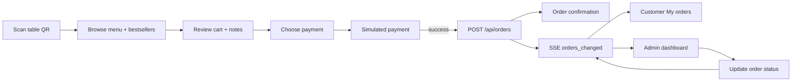

# QR Order System — Olive & Oak

A mini restaurant QR ordering system for **Olive & Oak**. Customers scan a table QR code to browse the menu (with live bestseller highlights), build a cart, and pay via a simulated checkout. They can track order status in real time from **My orders**. Staff monitor, fulfill, and generate table QR codes from a single admin dashboard with live updates.

## Stack

- **Frontend:** React 18 + Vite + Tailwind CSS + React Router
- **Backend:** Node.js + Express + mysql2
- **Database:** MySQL 8

## Setup

### Prerequisites

Install these before you begin:

| Tool | Version | Notes |
|------|---------|-------|
| [Node.js](https://nodejs.org/) | 18+ (20 LTS recommended) | Includes `npm` |
| [MySQL](https://dev.mysql.com/downloads/) | 8.x | Server must be running locally or reachable on your network |
| Git | Any recent version | To clone the repository |

Confirm they are available:

```bash
node -v
npm -v
mysql --version
```

### 1. Clone and enter the project

```bash
git clone <repository-url>
cd QR-Order-System
```

### 2. Install dependencies

From the project root:

```bash
npm install
```

This installs root, backend, and frontend packages (`postinstall` runs the workspace installs automatically).

To install backend and frontend only (without root dev tools):

```bash
npm run install:all
```

### 3. Create the database

Make sure the MySQL server is running, then apply the schema. It creates the `mini_qr_ordering_system` database and all tables (`products`, `orders`, `order_items`).

**macOS / Linux / Git Bash:**

```bash
mysql -u root -p < backend/db/schema.sql
```

**Windows (PowerShell)** — run from the project root:

```powershell
Get-Content backend\db\schema.sql | mysql -u root -p
```

**Alternative:** open `backend/db/schema.sql` in MySQL Workbench (or another client) and execute the script.

If you are upgrading an older database that predates kitchen notes, run:

```bash
npm run migrate --prefix backend
```

Fresh installs from `schema.sql` do not need this step.

### 4. Configure environment variables

Copy the example env file and edit it with your MySQL credentials:

**macOS / Linux / Git Bash:**

```bash
cp backend/.env.example backend/.env
```

**Windows (PowerShell):**

```powershell
Copy-Item backend\.env.example backend\.env
```

Edit `backend/.env`:

```env
DB_HOST=localhost
DB_PORT=3306
DB_USER=root
DB_PASS=your_mysql_password
DB_NAME=mini_qr_ordering_system
PORT=4000
TAX_RATE=0.12
FRONTEND_URL=http://localhost:5173
```

| Variable | Purpose |
|----------|---------|
| `DB_HOST` / `DB_PORT` | MySQL connection |
| `DB_USER` / `DB_PASS` | MySQL credentials (`DB_PASS` can be empty for a local root user with no password) |
| `DB_NAME` | Must match the database created by `schema.sql` |
| `PORT` | Backend API port (default `4000`) |
| `TAX_RATE` | Decimal tax rate applied server-side when creating orders (default `0.12` = 12%) |
| `FRONTEND_URL` | Allowed CORS origin for the frontend dev server |

### 5. Seed sample menu data

Populate the database with Olive & Oak menu items (13 products across Appetizers, Main Dish, Desserts, and Drinks):

```bash
npm run seed
```

**Note:** Seeding clears existing `products`, `orders`, and `order_items` before inserting fresh menu data. Safe for local development; do not run on production data you want to keep.

Expected output:

```
Connected to database. Seeding products...
Seeded 13 products successfully.
```

### 6. Start the development servers

```bash
npm run dev
```

This starts both services concurrently:

| Service | URL |
|---------|-----|
| Frontend (Vite) | http://localhost:5173 |
| Backend (Express) | http://localhost:4000 |

The frontend proxies `/api/*` to the backend, so the browser only needs to talk to port `5173` during development.

To run one service at a time:

```bash
npm run dev:backend    # API only
npm run dev:frontend   # UI only (requires backend for menu/orders)
```

### 7. Verify the installation

1. **API health check** — open http://localhost:4000/api/health  
   Expected: `{"status":"ok"}`

2. **Menu data** — open http://localhost:4000/api/products  
   Expected: JSON with 13 menu items, each including `units_sold` (0 on a fresh seed).

3. **Frontend** — open http://localhost:5173  
   You should land on the admin dashboard.

4. **Test an order**
   - Open http://localhost:5173/order?table=1
   - Add items to the cart, proceed through checkout, and complete the simulated payment
   - Open **My orders** on the menu screen (or return to `/admin`) and confirm the order appears with live status updates

### Production build (optional)

Build the frontend for static hosting:

```bash
npm run build
```

Output is written to `frontend/dist`. Serve it behind a reverse proxy that forwards `/api` to the Express backend (same pattern as the Vite dev proxy).

Start the backend in production:

```bash
npm run start --prefix backend
```

### Troubleshooting

| Problem | Likely cause | Fix |
|---------|--------------|-----|
| `ECONNREFUSED` or seed/API DB errors | MySQL not running or wrong credentials | Start MySQL; verify `backend/.env` matches your server |
| `Unknown database` | Schema not applied | Re-run step 3 (`schema.sql`) |
| Frontend loads but menu is empty / API errors | Backend not running | Run `npm run dev:backend` or full `npm run dev` |
| `Port 4000 already in use` | Another process on that port | Change `PORT` in `backend/.env` and update the Vite proxy target in `frontend/vite.config.js` |
| `Port 5173 already in use` | Another Vite app running | Stop the other process or change the port in `frontend/vite.config.js` |
| `mysql` command not found | MySQL CLI not in PATH | Use MySQL Workbench, or add MySQL `bin` to your system PATH |
| Seed fails with access denied | Wrong `DB_USER` / `DB_PASS` | Update `backend/.env` and retry |
| `Too many orders` (HTTP 429) | Table hit the order rate limit | Wait 5 minutes or use a different table number |

## Application Flow

### Restaurant deployment

1. Open **`/admin`** (the app root `/` redirects here).
2. Click **QR Codes** to set the number of tables and download codes (individual PNG or bulk PDF).
3. Each QR encodes `{origin}/order?table=N` — print and place on tables.
4. Use the same dashboard to monitor incoming orders and advance their status.

### Customer flow

```
Scan QR → Menu → Cart → Checkout → Payment → Confirmation → My orders
```

| Step | Screen | What happens |
|------|--------|--------------|
| 1 | **Menu** | Customer lands on `/order?table=N`. Menu loads from the API, grouped by category. A **Best sellers** row highlights the top three items by units sold (once orders exist). Tap an item to open its detail modal and add to cart. |
| 2 | **Cart** | Review line items, adjust quantities, add an optional kitchen note, and see subtotal + 12% tax. |
| 3 | **Checkout** | Confirm table number, choose **GCash** or **Card**, and review the order summary. |
| 4 | **Payment** | Tap **Confirm & Pay** to run the payment simulator (~90% success). On success, the order is posted to the API. |
| 5 | **Confirmation** | Shows order number and a live progress indicator. Customer can open **My orders** or return to the menu to order again. |
| 6 | **My orders** | Lists all orders for the current table with line items, totals, and status badges. Active orders show a step progress bar that updates in real time as staff advance the order. |

Orders are created with `payment_status: paid` and `order_status: received`. Visiting `/order` without a valid `?table=` query shows an invalid-table message. Order placement is rate-limited to 5 orders per table every 5 minutes.

### Staff flow (admin)

1. Open **`/admin`** — the dashboard receives live updates via Server-Sent Events (with a 90-second polling fallback).
2. Review stats for **Today**, **This week**, **This month**, or **All time**: order count, active orders, completed count, and paid revenue.
3. Filter the order list by status (All, Active, Ready, Completed, Cancelled).
4. Expand an order row to see line items and kitchen notes.
5. Advance **`order_status`** through the lifecycle:

   `received` → `preparing` → `ready` → `completed`

   Orders can also be set to `cancelled`. Status changes push instantly to customer **My orders** screens.
6. Delete orders permanently when needed (with confirmation).
7. Open the **QR Codes** panel to generate and download table QR codes.

Payment status is set at checkout and is read-only in the admin UI.



## Routes

| URL | Description |
|-----|-------------|
| `/` | Redirects to `/admin` |
| `/order?table=N` | Customer ordering (mobile-style UI; requires valid table 1–99) |
| `/admin` | Admin dashboard — orders, stats, status updates, and QR code generation |
| `/admin?tab=qr` | Admin dashboard with the QR Codes panel open |
| `/qr-generator` | Redirects to `/admin?tab=qr` (legacy alias) |

## API Endpoints

| Method | Endpoint | Description |
|--------|----------|-------------|
| GET | `/api/health` | Health check — returns `{ "status": "ok" }` |
| GET | `/api/products` | List available menu items with `units_sold` (from non-cancelled orders) |
| GET | `/api/orders` | List orders with line items. Optional query: `?status=received`, `?table_number=N` |
| GET | `/api/orders/events` | SSE stream — emits `orders_changed` when orders are created, updated, or deleted |
| POST | `/api/orders` | Create order after payment. Body: `table_number`, `items[]`, optional `payment_method` (`gcash` \| `card`), optional `notes`. Rate-limited to 5 requests per table per 5 minutes |
| PATCH | `/api/orders/:id` | Update `order_status` only |
| DELETE | `/api/orders/:id` | Permanently delete an order and its items |

See [step 4](#4-configure-environment-variables) for environment variable details.
